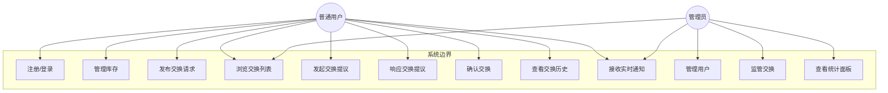
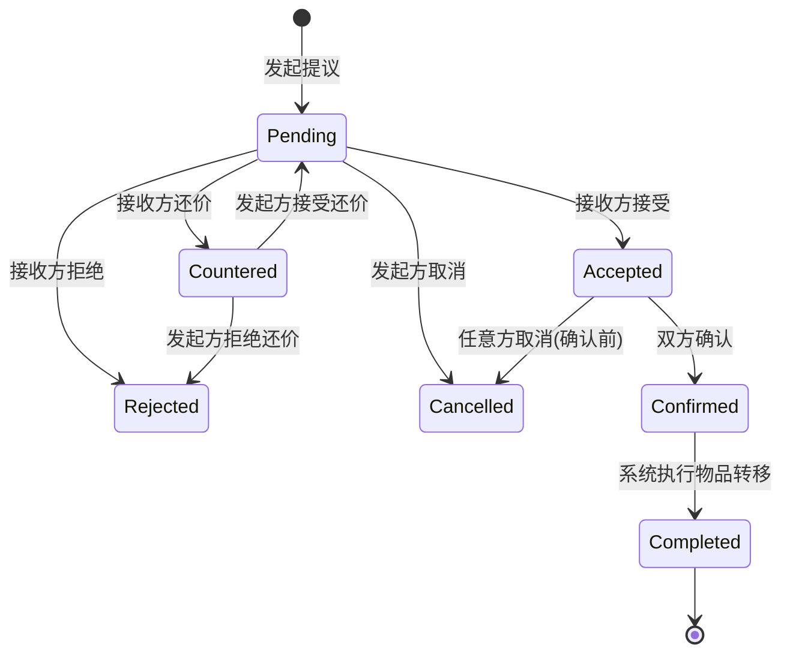
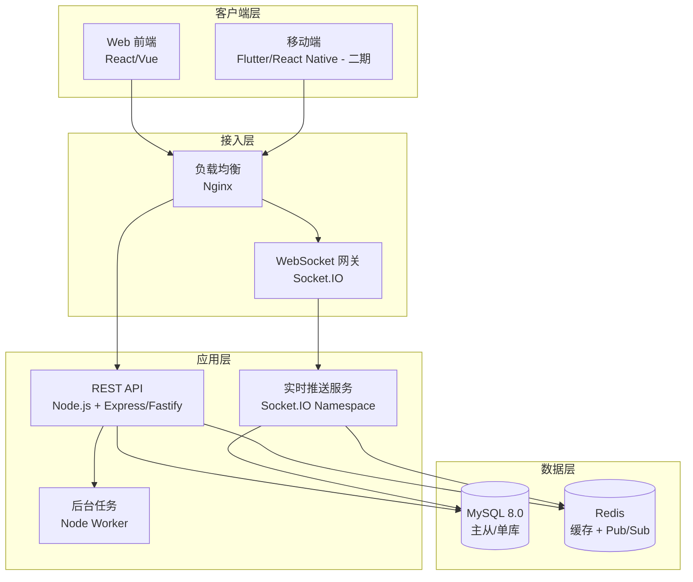

# CS饰品交换平台 — 需求分析报告

> 版本: v1.0  
> 日期: 2026-06-06  
> 状态: 规划草案 / 待评审  

---

## 1. 项目背景

### 1.1 业务目标
构建一个面向《Counter-Strike 2》（CS2）玩家的饰品（武器皮肤、刀具、手套、贴纸、探员等）**P2P 交换平台**，让玩家能够：

- 发布自己愿意用于交换的饰品列表  
- 浏览其他玩家发布的交换需求  
- 实时发起、协商、确认饰品互换  
- 获得全流程的实时通知和状态推送  

### 1.2 核心价值

| 维度 | 说明 |
|------|------|
| **流动性** | 让玩家在不通过第三方市场买卖现金的前提下盘活闲置饰品 |
| **实时性** | 基于 WebSocket 的即时推送，交换过程无感知延迟 |
| **可信度** | 用户信誉体系 + 交换记录可追溯，降低欺诈风险 |
| **可扩展** | 后端设计预留 Steam API 对接、支付系统、拍卖功能等扩展点 |

---

## 2. 功能需求 (Functional Requirements)

### 2.1 用户模块

| 编号 | 需求 | 级别 | 说明 |
|------|------|------|------|
| F-01 | 用户注册 | P0 | 邮箱 + 密码（bcrypt 哈希），发送验证邮件 |
| F-02 | 用户登录 | P0 | JWT access_token + refresh_token |
| F-03 | 用户资料管理 | P1 | 头像、昵称、Steam ID、联系方式（可选） |
| F-04 | 用户信誉评分 | P2 | 基于成功交换次数的星级体系 |

### 2.2 饰品 / 库存模块

| 编号 | 需求 | 级别 | 说明 |
|------|------|------|------|
| F-05 | 添加饰品到库存 | P0 | 手动录入饰品名称、类型、品质、磨损、截图 |
| F-06 | 查看我的库存 | P0 | 列表 / 网格视图，支持筛选和搜索 |
| F-07 | 编辑 / 删除库存饰品 | P0 | 仅本人可操作 |
| F-08 | 饰品分类体系 | P1 | 武器、刀具、手套、贴纸、探员等 5 个大类 |
| F-09 | 饰品价格参考（可选） | P2 | 对接第三方价格 API 展示参考价位 |

### 2.3 交换模块（核心）

| 编号 | 需求 | 级别 | 说明 |
|------|------|------|------|
| F-10 | 发布交换请求（Listing） | P0 | 选择 1 个拿出物 + 描述期望交换的品类 / 具体饰品 |
| F-11 | 浏览交换列表 | P0 | 按品类、品质、时间排序，关键词搜索 |
| F-12 | 发起交换提议（Offer） | P0 | 向一个 Listing 发起：我拿出 A、B，换你的 C |
| F-13 | 响应交换提议 | P0 | 接受 / 拒绝 / 还价（修改 Proposal 内物品） |
| F-14 | 交换确认 | P0 | 双方确认后状态锁定，记录不可篡改 |
| F-15 | 交换完成 / 取消 | P0 | 完成标记后双方库存互移；任何一方可取消（未确认前） |
| F-16 | 交换历史 | P1 | 查看全部历史交换记录，含时间线、物品快照、双方用户 |

### 2.4 实时通信模块

| 编号 | 需求 | 级别 | 说明 |
|------|------|------|------|
| F-17 | WebSocket 连接管理 | P0 | JWT 鉴权后建立 WS 长连接 |
| F-18 | 新交换提议实时推送 | P0 | A 发起后 B 即时收到通知卡片 & 未读计数 |
| F-19 | 提议响应实时推送 | P0 | B 操作后 A 即时收到结果 |
| F-20 | 交换状态变更推送 | P0 | 确认 / 完成 / 取消 均实时同步 |
| F-21 | 在线状态广播 | P1 | 显示哪些用户 / 卖家当前在线 |
| F-22 | 交换内即时消息（可选） | P2 | 协商过程中的文字聊天 |

### 2.5 管理后台

| 编号 | 需求 | 级别 | 说明 |
|------|------|------|------|
| F-23 | 用户管理 | P1 | 查看、禁用用户 |
| F-24 | 交换监管 | P1 | 查看进行中的交换、干预问题交易 |
| F-25 | 基础统计面板 | P2 | 日活、交换量、热门饰品等指标 |

---

## 3. 非功能需求 (Non-Functional Requirements)

| 编号 | 需求 | 指标 / 说明 |
|------|------|-------------|
| NFR-01 | **实时性** | WebSocket 消息端到端延迟 < 500ms (95 分位) |
| NFR-02 | **可用性** | 核心交换链路 99.9% 可用（计划内维护除外） |
| NFR-03 | **并发** | 初期支持 500 同时在线 WS 连接，水平可扩展 |
| NFR-04 | **响应时间** | REST API 95% 请求 < 200ms |
| NFR-05 | **安全性** | JWT 鉴权、CSRF 防护、速率限制、敏感操作日志 |
| NFR-06 | **数据一致性** | 交换事务必须 ACID，防止"双花"（同一饰品同时被交换） |
| NFR-07 | **可维护性** | 模块化架构，Swagger/OpenAPI 文档 |
| NFR-08 | **可测试性** | 单元测试 > 70% 覆盖率，核心交换逻辑 > 85% |
| NFR-09 | **合规性** | 用户数据隐私（遵循相关法规），交换记录可审计 |

---

## 4. 业务规则与约束

1. **库存互斥**：一件饰品同时只能出现在一个未完成的 Listing 或 Offer 中。一旦锁定，其他用户不可重复操作。
2. **所有权验证**：仅饰品拥有者可将其添加进交换提议；系统校验 user_id 与 item.owner_id 匹配。
3. **不可重入**：交换确认是两阶段提交（Proposal → 双方 Confirm → 完成），状态机防重入。
4. **公平保障**：提议修改（还价）创建新版本，原版本作废，避免争议。
5. **审计留痕**：所有交换状态变更记录 event log，支持全链路回溯。
6. **速率限制**：单用户每秒最多 5 次 REST 请求（普通端点），WS 消息频率另设阈值。

---

## 5. 数据实体关系 (ER)

```
User 1──N InventoryItem
User 1──N Listing
User 1──N Trade (as proposer / as receiver)
Listing 1──N TradeOffer
TradeOffer 1──N OfferItem
InventoryItem 1──1? OfferItem (when locked)

核心实体:

├── User
│   ├── id, email, username, password_hash
│   ├── avatar_url, steam_id, reputation_score
│   ├── created_at, updated_at, last_login
│   └── status (active / disabled)
│
├── InventoryItem
│   ├── id, owner_id (FK→User)
│   ├── name, category (weapon/knife/gloves/sticker/agent)
│   ├── quality (FN/MW/FT/WW/BS), rarity
│   ├── image_url, description
│   ├── status (available / locked / traded)
│   └── created_at, updated_at
│
├── Listing (交换请求)
│   ├── id, seller_id (FK→User)
│   ├── offered_item_id (FK→InventoryItem)
│   ├── want_description / want_category / want_specific_item
│   ├── status (active / matched / closed)
│   └── created_at, updated_at
│
├── TradeOffer (交换提议)
│   ├── id, listing_id (FK→Listing)
│   ├── proposer_id (FK→User), receiver_id (FK→User)
│   ├── status (pending / accepted / rejected / countered / cancelled / completed)
│   ├── proposer_items[] (OfferItem[]), receiver_items[] (OfferItem[])
│   └── created_at, updated_at
│
├── OfferItem (提议中的物品)
│   ├── id, trade_offer_id (FK→TradeOffer)
│   ├── inventory_item_id (FK→InventoryItem)
│   ├── side (proposer / receiver)
│   └── created_at
│
└── EventLog (审计日志)
    ├── id, trade_offer_id (FK→TradeOffer)
    ├── event_type (created / accepted / rejected / countered / completed / cancelled)
    ├── actor_id (FK→User)
    └── metadata (JSON), created_at
```

---

## 6. 用例图 (Use Case Diagram)



---

## 7. 交换流程状态机



---

## 8. 系统架构图



---

## 9. 部署图 (Deployment Diagram)

```mermaid
graph TB
    subgraph Ubuntu 服务器 / WSL
        subgraph 反向代理层
            NGINX["nginx<br/>反向代理<br/>端口 80/443"]
        end

        subgraph Node应用层 (PM2 Cluster)
            API_INSTANCE["server.js x1-x4<br/>Cluster Mode<br/>端口 3000-3003"]
        end

        subgraph 数据层
            MYSQL["MySQL 8.0<br/>端口 3306<br/>数据库: cs_trade_db"]
            REDIS["Redis 7.x<br/>端口 6379<br/>缓存 / WS PubSub"]
        end

        subgraph 持久化
            LOG_DIR["/var/log/cs-trade/<br/>应用日志"]
            BACKUP_DIR["/data/backups/<br/>数据库备份"]
        end
    end

    CLIENT["浏览器 / 移动端"] --> NGINX
    NGINX --> API_INSTANCE
    API_INSTANCE --> MYSQL
    API_INSTANCE --> REDIS
```

---

## 10. 技术选型

| 层 | 方案 | 理由 |
|----|------|------|
| **后端语言** | Node.js (TypeScript) | 事件驱动适合大量 WebSocket 长连接；v22 LTS |
| **框架** | Express.js + Socket.IO | Express 生态成熟；Socket.IO 提供 Rooms/Namespaces 开箱即用 |
| **ORM** | Prisma | 类型安全、迁移管理友好、支持 MySQL 事务 |
| **数据库** | MySQL 8.0 | 本地已有；ACID 事务保证交换一致性；行锁防并发冲突 |
| **缓存** | Redis (ioredis) | WS Pub/Sub 跨进程广播、速率限制、Session 缓存 |
| **认证** | JWT (jsonwebtoken) | 无状态，REST + WS 统一鉴权 |
| **API 文档** | Swagger (swagger-jsdoc) | OpenAPI 3.0 标准 |
| **测试** | Jest + Supertest | 单元 + 集成测试；覆盖率报告 |
| **进程管理** | PM2 | Cluster 模式多核利用；零停机重载 |
| **部署** | Ubuntu 22.04 / WSL | 用户指定 |

---

## 11. API 路由设计 (初步)

### 公开端点

```
POST   /api/auth/register       # 注册
POST   /api/auth/login          # 登录
POST   /api/auth/refresh        # 刷新 Token
```

### 用户端点 (需 JWT)

```
GET    /api/users/me            # 获取本人信息
PATCH  /api/users/me            # 更新资料
GET    /api/users/:id           # 查看公开资料
```

### 库存端点

```
GET    /api/inventory           # 我的库存列表
POST   /api/inventory           # 添加饰品
GET    /api/inventory/:id       # 饰品详情
PATCH  /api/inventory/:id       # 编辑饰品
DELETE /api/inventory/:id       # 删除饰品
```

### 交换请求 (Listing)

```
GET    /api/listings            # 浏览所有交换请求 (可筛选)
POST   /api/listings            # 发布交换请求
GET    /api/listings/:id        # 查看单个请求
PATCH  /api/listings/:id        # 编辑请求
DELETE /api/listings/:id        # 关闭请求
GET    /api/listings/my         # 我发布的请求
```

### 交换提议 (TradeOffer)

```
GET    /api/offers              # 我收到/发出的提议
POST   /api/offers              # 发起提议
GET    /api/offers/:id          # 查看提议详情
POST   /api/offers/:id/accept   # 接受
POST   /api/offers/:id/reject   # 拒绝
POST   /api/offers/:id/counter  # 还价
POST   /api/offers/:id/confirm  # 确认交换
POST   /api/offers/:id/cancel   # 取消
```

### 交换历史

```
GET    /api/trades              # 我的交换历史
GET    /api/trades/:id          # 交换详情
```

### 通知

```
GET    /api/notifications       # 通知列表
PATCH  /api/notifications/:id   # 标记已读
```

### WebSocket 命名空间

```
ws://host/ws                    # 需要 JWT query 参数鉴权
  -> 事件: notification         # 新通知
  -> 事件: offer_update         # 提议状态变更
  -> 事件: listing_update       # 交换列表更新
  -> 事件: user_online          # 用户在线状态
  -> 事件: chat_message         # (P2) 即时消息
```

---

## 12. 实施路线图

| 阶段 | 内容 | 预估时间 |
|------|------|----------|
| **Phase 0** | 环境准备: 安装 WSL Ubuntu、Node.js、MySQL、Redis | 0.5 天 |
| **Phase 1** | 项目脚手架: Express + Prisma + Socket.IO 基础框架 | 1 天 |
| **Phase 2** | 用户认证模块: 注册/登录/JWT/中间件 | 1 天 |
| **Phase 3** | 库存模块: CRUD + 饰品分类 | 1 天 |
| **Phase 4** | 交换核心: Listing + Offer + 状态机 | 2.5 天 |
| **Phase 5** | 实时推送: Socket.IO 集成 + 事件绑定 | 1 天 |
| **Phase 6** | 管理后台 API + 审计日志 | 1 天 |
| **Phase 7** | 测试 (单元 + 集成 + E2E) | 1.5 天 |
| **Phase 8** | 部署 + 文档 + 上线检查清单 | 0.5 天 |
| **合计** | | **~10 天** |

---

## 13. 风险评估

| 风险 | 概率 | 影响 | 缓解措施 |
|------|------|------|----------|
| 并发交换请求导致数据不一致 | 中 | 高 | MySQL 行锁 + 乐观锁（version 字段）|
| WebSocket 连接数突增 | 中 | 中 | PM2 Cluster + Nginx WS 负载均衡；Redis Pub/Sub |
| 用户提交虚假饰品信息 | 高 | 中 | 审核上架 + 信誉体系 + 举报机制 |
| 部署环境不一致（WSL vs 生产） | 低 | 中 | Docker 容器化标准化 |
| 第三方 Steam API 不可用 | 低 | 低 | 手动录入兜底，API 仅为可选增强 |
