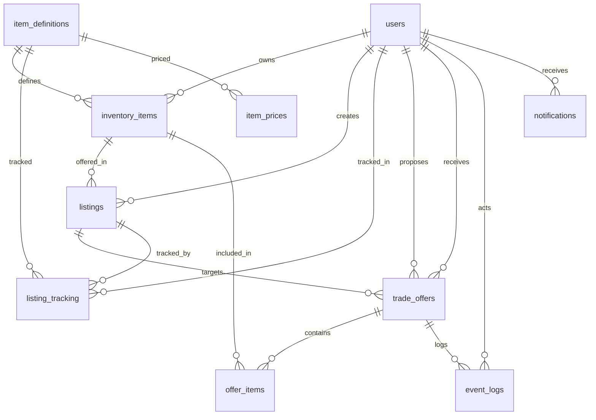

# CS饰品交换平台 — 数据库详细设计

> 版本: v1.1（修订版）  
> 基于用户反馈: 增加装备数据字典表、上架跟踪表、饰品价格参考表  

---

## 1. 设计思路

之前的 ER 设计将"装备"直接作为 InventoryItem 的自由文本存储，缺少全局统一的商品目录。
本次修订的核心变化：

```
改动前: InventoryItem(name="AK-47 | 红线")  ← 每个用户各写各的，无法统一关联
改动后:
  item_definitions(id=1001, name="AK-47 | 红线", category="weapon", ...)  ← 全局字典
  inventory_items(definition_id=1001, owner_id=42, quality="FT", ...)      ← 用户实例
  listing_tracking(definition_id=1001, user_id=42, listing_id=101, ...)   ← 谁在出
  item_prices(definition_id=1001, quality="FT", source="buff", price=128.50)  ← 参考价
```

---

## 2. 完整表结构

### 2.1 用户表 `users`

```sql
CREATE TABLE users (
  id              BIGINT UNSIGNED AUTO_INCREMENT PRIMARY KEY,
  email           VARCHAR(255) NOT NULL UNIQUE,
  username        VARCHAR(50) NOT NULL UNIQUE,
  password_hash   VARCHAR(255) NOT NULL,
  avatar_url      VARCHAR(500),
  steam_id        VARCHAR(64) UNIQUE,
  reputation_score INT DEFAULT 0,
  trade_count     INT DEFAULT 0,
  status          ENUM('active','disabled') DEFAULT 'active',
  last_login      TIMESTAMP NULL,
  created_at      TIMESTAMP DEFAULT CURRENT_TIMESTAMP,
  updated_at      TIMESTAMP DEFAULT CURRENT_TIMESTAMP ON UPDATE CURRENT_TIMESTAMP,
  INDEX idx_status (status)
) ENGINE=InnoDB DEFAULT CHARSET=utf8mb4;
```

### 2.2 装备数据字典表 `item_definitions`

这是全局唯一的"CS 饰品目录"，一条记录 = 一种具体的饰品类型（例如"AK-47 | 红线 (Field-Tested)"）。
所有用户库存、上架、价格都通过 `definition_id` 引用到这里。

```sql
CREATE TABLE item_definitions (
  id                    BIGINT UNSIGNED AUTO_INCREMENT PRIMARY KEY,
  name                  VARCHAR(255) NOT NULL COMMENT '展示名: AK-47 | 红线',
  category              ENUM('weapon','knife','gloves','sticker','agent','case','key','other') NOT NULL,
  weapon_type           VARCHAR(100) COMMENT '武器型号: AK-47, M4A4, USP-S',
  skin_name             VARCHAR(255) COMMENT '皮肤名: 红线 (Redline)',
  rarity                ENUM('consumer','industrial','mil-spec','restricted','classified','covert','special','exceedingly_rare') NOT NULL,
  rarity_color          CHAR(7) COMMENT '#4b69ff 等色值',
  collection            VARCHAR(255) COMMENT '所属收藏品系列',
  market_hash_name      VARCHAR(255) NOT NULL COMMENT 'Steam市场唯一标识',
  inspect_url_template  TEXT COMMENT '检视链接模板，替换 {asset_id} 等占位符',
  image_url             VARCHAR(500) COMMENT '饰品图片URL',
  is_tradable           BOOLEAN DEFAULT TRUE,
  created_at            TIMESTAMP DEFAULT CURRENT_TIMESTAMP,
  updated_at            TIMESTAMP DEFAULT CURRENT_TIMESTAMP ON UPDATE CURRENT_TIMESTAMP,

  UNIQUE INDEX idx_market_hash (market_hash_name),
  INDEX idx_category (category),
  INDEX idx_rarity (rarity),
  INDEX idx_weapon_type (weapon_type)
) ENGINE=InnoDB DEFAULT CHARSET=utf8mb4;
```

**使用场景举例：**
- 新用户添加库存时，从字典中选择装备，而非手动输入
- 搜索"AK-47"时，一条 SQL 即可拿到所有相关库存
- 查询"某饰品当前多少人挂出来交换"，通过 `listing_tracking` 秒级返回

### 2.3 用户库存表 `inventory_items`

用户实际拥有的"实例"，每条记录关联一个 `definition_id`。

```sql
CREATE TABLE inventory_items (
  id              BIGINT UNSIGNED AUTO_INCREMENT PRIMARY KEY,
  owner_id        BIGINT UNSIGNED NOT NULL,
  definition_id   BIGINT UNSIGNED NOT NULL COMMENT '关联数据字典',
  quality         ENUM('FN','MW','FT','WW','BS') NOT NULL COMMENT '磨损等级',
  float_value     DECIMAL(10,8) COMMENT '精确磨损值 0.00000000 ~ 1.00000000',
  pattern         INT UNSIGNED COMMENT '模板号(图案编号)',
  sticker_details JSON COMMENT '贴花信息: [{slot, sticker_id, wear}]',
  stat_trak       BOOLEAN DEFAULT FALSE COMMENT '是否StatTrak™',
  souvenir        BOOLEAN DEFAULT FALSE COMMENT '是否纪念品',
  description     TEXT COMMENT '用户自定义备注',
  image_url       VARCHAR(500) COMMENT '截图',
  status          ENUM('available','locked','traded','removed') DEFAULT 'available',
  created_at      TIMESTAMP DEFAULT CURRENT_TIMESTAMP,
  updated_at      TIMESTAMP DEFAULT CURRENT_TIMESTAMP ON UPDATE CURRENT_TIMESTAMP,

  FOREIGN KEY (owner_id) REFERENCES users(id),
  FOREIGN KEY (definition_id) REFERENCES item_definitions(id),
  INDEX idx_owner (owner_id),
  INDEX idx_definition (definition_id),
  INDEX idx_owner_status (owner_id, status),
  INDEX idx_def_quality (definition_id, quality)
) ENGINE=InnoDB DEFAULT CHARSET=utf8mb4;
```

### 2.4 交换请求表 `listings`

用户 "我要拿这个装备，换什么"。

```sql
CREATE TABLE listings (
  id                          BIGINT UNSIGNED AUTO_INCREMENT PRIMARY KEY,
  seller_id                   BIGINT UNSIGNED NOT NULL,
  offered_item_id             BIGINT UNSIGNED NOT NULL COMMENT '拿出的库存物品',
  want_description            TEXT COMMENT '期望交换的文本描述',
  want_category               VARCHAR(50) COMMENT '期望品类',
  want_specific_definition_id BIGINT UNSIGNED COMMENT '期望的具体装备(可选)',
  want_quality                ENUM('FN','MW','FT','WW','BS','any') DEFAULT 'any',
  status                      ENUM('active','matched','closed','cancelled') DEFAULT 'active',
  created_at                  TIMESTAMP DEFAULT CURRENT_TIMESTAMP,
  updated_at                  TIMESTAMP DEFAULT CURRENT_TIMESTAMP ON UPDATE CURRENT_TIMESTAMP,

  FOREIGN KEY (seller_id) REFERENCES users(id),
  FOREIGN KEY (offered_item_id) REFERENCES inventory_items(id),
  FOREIGN KEY (want_specific_definition_id) REFERENCES item_definitions(id),
  INDEX idx_seller (seller_id),
  INDEX idx_status (status),
  INDEX idx_created_desc (created_at DESC)
) ENGINE=InnoDB DEFAULT CHARSET=utf8mb4;
```

### 2.5 上架跟踪表 `listing_tracking` ← ★ 你特别提到的

这张表是 **专门为"快速统计某装备有多少玩家在上架"** 设计的。
每次用户创建一个 Listing，这里就插入一条记录；Listing 关闭或取消时，状态设为 inactive。

```sql
CREATE TABLE listing_tracking (
  id            BIGINT UNSIGNED AUTO_INCREMENT PRIMARY KEY,
  definition_id BIGINT UNSIGNED NOT NULL COMMENT '装备字典ID',
  user_id       BIGINT UNSIGNED NOT NULL COMMENT '上架用户',
  listing_id    BIGINT UNSIGNED NOT NULL COMMENT '对应的交换请求',
  status        ENUM('active','inactive') DEFAULT 'active',
  created_at    TIMESTAMP DEFAULT CURRENT_TIMESTAMP,
  updated_at    TIMESTAMP DEFAULT CURRENT_TIMESTAMP ON UPDATE CURRENT_TIMESTAMP,

  FOREIGN KEY (definition_id) REFERENCES item_definitions(id),
  FOREIGN KEY (user_id) REFERENCES users(id),
  FOREIGN KEY (listing_id) REFERENCES listings(id),

  UNIQUE INDEX idx_unique_listing (listing_id) COMMENT '一个listing只对应一条跟踪记录',
  INDEX idx_def_status (definition_id, status) COMMENT '核心查询: 某装备有多少活跃上架',
  INDEX idx_user_active (user_id, status)
) ENGINE=InnoDB DEFAULT CHARSET=utf8mb4;
```

**查询示例：**

```sql
-- 某装备当前有多少人在出？
SELECT COUNT(DISTINCT user_id) AS user_count
FROM listing_tracking
WHERE definition_id = 1001 AND status = 'active';

-- 某装备当前有哪几位玩家在上架？
SELECT u.id, u.username, lt.listing_id
FROM listing_tracking lt
JOIN users u ON u.id = lt.user_id
WHERE lt.definition_id = 1001 AND lt.status = 'active';
```

### 2.6 饰品价格参考表 `item_prices` ← ★ 你说的价格存储

定期从三方市场抓取，记录不同品质、不同来源的参考价。

```sql
CREATE TABLE item_prices (
  id            BIGINT UNSIGNED AUTO_INCREMENT PRIMARY KEY,
  definition_id BIGINT UNSIGNED NOT NULL,
  quality       ENUM('FN','MW','FT','WW','BS') NOT NULL,
  stat_trak     BOOLEAN DEFAULT FALSE,
  source        ENUM('steam','buff','igxe','youpin','other') NOT NULL COMMENT '数据来源',
  price_min     DECIMAL(12,2) COMMENT '最低在售价',
  price_max     DECIMAL(12,2) COMMENT '最高在售价',
  price_avg     DECIMAL(12,2) COMMENT '平均参考价',
  volume_24h    INT COMMENT '24小时成交量',
  currency      VARCHAR(3) DEFAULT 'CNY',
  fetched_at    TIMESTAMP NOT NULL COMMENT '数据抓取时间',
  created_at    TIMESTAMP DEFAULT CURRENT_TIMESTAMP,

  FOREIGN KEY (definition_id) REFERENCES item_definitions(id),
  INDEX idx_definition (definition_id),
  INDEX idx_source (source),
  INDEX idx_fetched_at (fetched_at),
  INDEX idx_def_quality_time (definition_id, quality, stat_trak, fetched_at DESC)
) ENGINE=InnoDB DEFAULT CHARSET=utf8mb4;
```

**价格抓取策略（P2 功能，可后续实现）：**

```
定时任务 (node-cron / Bull Queue):
  ┌─────────────┐    ┌──────────────┐    ┌──────────────┐
  │ 每天 06:00   │ -> │ 请求三方API   │ -> │ 写入item_    │
  │ 12:00 18:00 │    │ Steam/Buff    │    │ prices 表    │
  │ 24:00       │    │ IGXE/悠悠有品 │    │ (批量upsert) │
  └─────────────┘    └──────────────┘    └──────────────┘
```

第三方来源建议：
- **Steam Community Market** — 免费，有 API，数据全但价格偏高（有税费）
- **Buff.163** — 国内最大 CS 饰品交易平台，需反爬或合作
- **IGXE / 悠悠有品** — 国内二三线市场

### 2.7 交换提议表 `trade_offers`

```sql
CREATE TABLE trade_offers (
  id              BIGINT UNSIGNED AUTO_INCREMENT PRIMARY KEY,
  listing_id      BIGINT UNSIGNED NOT NULL,
  proposer_id     BIGINT UNSIGNED NOT NULL COMMENT '发起方',
  receiver_id     BIGINT UNSIGNED NOT NULL COMMENT '接收方(Listing发布者)',
  status          ENUM('pending','accepted','rejected','countered',
                       'cancelled','confirmed','completed') DEFAULT 'pending',
  proposer_note   TEXT,
  receiver_note   TEXT,
  expires_at      TIMESTAMP COMMENT '提议过期时间(默认24h)',
  created_at      TIMESTAMP DEFAULT CURRENT_TIMESTAMP,
  updated_at      TIMESTAMP DEFAULT CURRENT_TIMESTAMP ON UPDATE CURRENT_TIMESTAMP,

  FOREIGN KEY (listing_id) REFERENCES listings(id),
  FOREIGN KEY (proposer_id) REFERENCES users(id),
  FOREIGN KEY (receiver_id) REFERENCES users(id),
  INDEX idx_listing (listing_id),
  INDEX idx_proposer (proposer_id),
  INDEX idx_receiver (receiver_id),
  INDEX idx_status (status)
) ENGINE=InnoDB DEFAULT CHARSET=utf8mb4;
```

### 2.8 提议物品表 `offer_items`

```sql
CREATE TABLE offer_items (
  id                BIGINT UNSIGNED AUTO_INCREMENT PRIMARY KEY,
  trade_offer_id    BIGINT UNSIGNED NOT NULL,
  inventory_item_id BIGINT UNSIGNED NOT NULL,
  side              ENUM('proposer','receiver') NOT NULL COMMENT '属于提议方还是接收方',
  created_at        TIMESTAMP DEFAULT CURRENT_TIMESTAMP,

  FOREIGN KEY (trade_offer_id) REFERENCES trade_offers(id),
  FOREIGN KEY (inventory_item_id) REFERENCES inventory_items(id),
  INDEX idx_offer (trade_offer_id)
) ENGINE=InnoDB DEFAULT CHARSET=utf8mb4;
```

### 2.9 审计日志表 `event_logs`

```sql
CREATE TABLE event_logs (
  id              BIGINT UNSIGNED AUTO_INCREMENT PRIMARY KEY,
  trade_offer_id  BIGINT UNSIGNED,
  actor_id        BIGINT UNSIGNED NOT NULL COMMENT '操作人',
  event_type      VARCHAR(50) NOT NULL COMMENT 'offer_created / accepted / rejected / confirmed / completed / cancelled',
  metadata        JSON COMMENT '操作时的上下文快照',
  ip_address      VARCHAR(45),
  created_at      TIMESTAMP DEFAULT CURRENT_TIMESTAMP,

  FOREIGN KEY (trade_offer_id) REFERENCES trade_offers(id),
  FOREIGN KEY (actor_id) REFERENCES users(id),
  INDEX idx_offer (trade_offer_id),
  INDEX idx_event_type (event_type),
  INDEX idx_created (created_at)
) ENGINE=InnoDB DEFAULT CHARSET=utf8mb4;
```

### 2.10 通知表 `notifications`

```sql
CREATE TABLE notifications (
  id          BIGINT UNSIGNED AUTO_INCREMENT PRIMARY KEY,
  user_id     BIGINT UNSIGNED NOT NULL,
  type        VARCHAR(50) NOT NULL COMMENT 'new_offer / offer_response / trade_complete / system',
  title       VARCHAR(255) NOT NULL,
  body        TEXT,
  data        JSON COMMENT '结构化数据供前端跳转用',
  is_read     BOOLEAN DEFAULT FALSE,
  created_at  TIMESTAMP DEFAULT CURRENT_TIMESTAMP,

  FOREIGN KEY (user_id) REFERENCES users(id),
  INDEX idx_user_unread (user_id, is_read),
  INDEX idx_created_desc (created_at DESC)
) ENGINE=InnoDB DEFAULT CHARSET=utf8mb4;
```

---

## 3. ER 关系图（修订版）



---

## 4. 核心查询性能分析

| 查询场景 | SQL 复杂度 | 预期性能 |
|----------|-----------|---------|
| 某装备当前多少人在出 | 单表 COUNT + 索引覆盖 | < 1ms |
| 搜索"AK-47"相关交换请求 | JOIN 3 表（definitions + tracking + users） | < 5ms |
| 用户打开自己所有库存 | 单表索引（owner_id + status） | < 2ms |
| 查看某交易的完整时间线 | event_logs 按 trade_offer_id 查询 | < 2ms |
| 某饰品的近期价格走势 | item_prices 按 definition_id + fetched_at 范围 | < 3ms |
| 首页"热门交换"列表 | listing_tracking 按 definition_id 聚合 + 排序 | < 10ms |

---

## 5. 与上一版设计的关键差异

| 项目 | 旧版 | 新版 |
|------|------|------|
| 装备名称存储 | 每个 InventoryItem 自由文本 | 统一在 item_definitions 字典中 |
| 装备分类 | 无独立分类 | category + weapon_type + rarity 三层 |
| 上架统计 | 需要多表 JOIN + COUNT(DISTINCT) | listing_tracking 直接索引覆盖 |
| 价格数据 | 无 | item_prices 表，支持多源、多品质、时间序列 |
| 磨损值 | 仅文本 quality | quality + float_value + pattern 精确存储 |
| 贴纸系统 | 无 | sticker_details JSON 字段 |
| 数据字典版本管理 | 无 | market_hash_name UNIQUE，可增量更新 |
| 库存状态 | 简单 status | available / locked(被提议锁定) / traded / removed |

---

## 6. 数据字典的初始化策略

上线初期，item_definitions 需要预填充数据。推荐方案：

```
Phase 1: 手动录入热门装备（前 500 个最热门皮肤）
  - 参考 CS2 饰品交易网站的热门榜
  - 录入 name, category, weapon_type, rarity, market_hash_name

Phase 2: 批量导入（对接三方数据源）
  - Steam API: https://api.steampowered.com/ISteamEconomy/...
  - 或解析社区市场 HTML / JSON

Phase 3: 持续维护
  - 新饰品发布时自动/手动更新字典
  - 下架/不可交易的饰品标记 is_tradable = false
```
